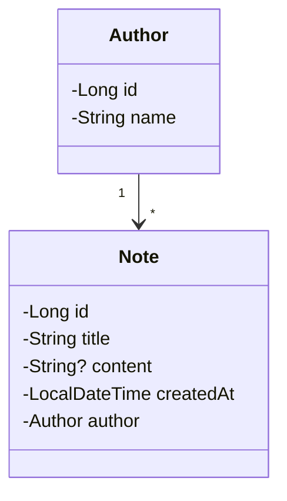

# Notatki REST

Prosty serwis REST do zarządzania notatkami. Każda notatka należy do konkretnego autora.

## Stack

- Java 17+
- Spring Boot
- Spring Data JPA
- H2

## Encje

## Funkcjonalności API

### Wymagane

- Authors:
    - `POST /authors` - utworzenie nowego autora
    - `GET /authors` - pobranie listy wszystkich autorów
    - `GET /authors/{id}` - pobranie autora po ID
- Notes:
    - `POST /notes` - utworzenie nowej notatki
    - `GET /notes` - pobranie listy wszystkich notatek
    - `GET /notes/{id}` - pobranie notatki po ID
    - `DELETE /notes/{id}` - usunięcie notatki po ID

### Dodatkowe

- Notes:
    - `GET /notes?authorId={authorId}` - pobranie listy notatek po ID autora

## Dodatkowe informacje

- Swagger jest dostępny pod adresem: `http:localhost:8080/swagger-ui.html`
- Konsola H2 jest dostępna pod adresem: `http:localhost:8080/h2`